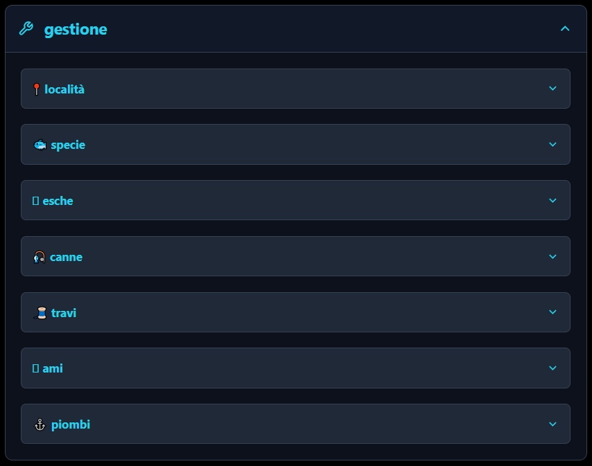

# 📱 Fish File - Manuale Utente
### Il tuo diario di pesca intelligente

---

## 🎯 Perché usare Fish File?

Ogni pescatore sa che **il successo non è questione di fortuna, ma di esperienza e dati**.

Quante volte ti sei chiesto:
- *"Dove avevo pescato quella bella spigola?"*
- *"Con che vento pescavo meglio in questo spot?"*
- *"Quale esca funziona meglio con mare mosso?"*
- *"In che fase lunare ho fatto più catture?"*

**Fish File trasforma la tua esperienza in conoscenza.**

Registrando ogni uscita con condizioni meteo, posizione GPS e risultati, costruisci un **database personale** che ti dirà esattamente:
✅ Dove andare in base alle previsioni meteo di oggi
✅ Quale attrezzatura usare
✅ Quali esche funzionano meglio in determinate condizioni
✅ Quando i pesci sono più attivi (maree, luna, temperatura)

**Non pescare più al buio. Pesca con i dati.**

---

## 📖 Indice

1. [Prima Configurazione](#1-prima-configurazione)
2. [Avviare una Sessione di Pesca](#2-avviare-una-sessione-di-pesca)
3. [Registrare le Condizioni Meteo](#3-registrare-le-condizioni-meteo)
   - 🚀 Recupero Automatico Dati Meteo (NOVITÀ!)
4. [Registrare una Cattura](#4-registrare-una-cattura)
5. [Usare l'Assistente Vocale](#5-usare-lassistente-vocale)
6. [Analizzare i Dati](#6-analizzare-i-dati)
   - 📊 Grafici Statistiche Interattivi (NOVITÀ!)
   - 🔍 Filtri Avanzati (Aggiornato: velocità vento, pressione, fase lunare)
7. [Gestire Attrezzature e Liste](#7-gestire-attrezzature-e-liste)
8. [Impostazioni e Personalizzazione](#8-impostazioni-e-personalizzazione)
   - 🌍 Cambio Lingua (4 lingue disponibili)
   - 📏 Sistema di Unità di Misura
   - 🔒 Gestione Permessi (GPS, Microfono)
   - 📱 Installazione PWA
   - 💾 Backup e Ripristino Dati
9. [Domande Frequenti](#9-domande-frequenti)

---

## 1. Prima Configurazione

Prima di iniziare a pescare, configura le tue liste personalizzate.

### Passo 1: Accedi alla sezione "Gestione"

Tocca la sezione **"gestione"** (icona chiave inglese 🔧).


*Immagine da inserire: Screenshot della schermata principale con la sezione "gestione" evidenziata*

---

### Passo 2: Aggiungi le tue Specie

1. Scorri fino alla sezione **"specie"**
2. Scrivi il nome della specie nel campo (es: "spigola")
3. Tocca **"+ aggiungi"**
4. Ripeti per tutte le specie che peschi


*Immagine da inserire: Campo input "specie" con esempio "spigola" e pulsante "+ aggiungi"*

**💡 Consiglio:** Aggiungi tutte le specie comuni della tua zona (spigola, orata, sarago, mormora, ombrina, etc.)

---

### Passo 3: Aggiungi le tue Esche

Stessa procedura per le esche:

1. Scorri fino alla sezione **"esche"**
2. Scrivi il nome dell'esca (es: "verme coreano")
3. Tocca **"+ aggiungi"**


*Immagine da inserire: Lista esche con esempi come "verme coreano", "gamberetto", "sardina", "artificiale minnow"*

---

### Passo 4: Aggiungi le tue Località

1. Scorri fino alla sezione **"località"**
2. Scrivi il nome del tuo spot (es: "Molo di Ostia")
3. Tocca **"+ aggiungi"**


*Immagine da inserire: Campo località con esempi memorizzati*

**💡 Nota:** Puoi anche modificare (icona matita ✏️) o eliminare (icona cestino 🗑️) voci esistenti.

---

### Passo 5: Aggiungi la tua Attrezzatura

Configura anche:
- **Canne** (es: "Bolognese 6m", "Spinning 2.70m")
- **Travi** (es: "0.20mm fluorocarbon")
- **Ami** (es: "n.8 Aberdeen")
- **Piombi** (es: "50g piramide")


*Immagine da inserire: Sezioni canne, travi, ami, piombi compilate*

---

## 2. Avviare una Sessione di Pesca

**⚠️ IMPORTANTE:** Devi avviare una sessione PRIMA di poter registrare catture.

### Passo 1: Compila i Dati della Sessione

Quando arrivi al tuo spot di pesca:

1. Seleziona o scrivi la **località** (es: "Molo di Fiumicino")
2. Premi il pulsante **"📡 Usa GPS Dispositivo"** per ottenere coordinate automatiche
   - Il telefono ti chiederà il permesso di usare la posizione → Accetta
   - Dopo pochi secondi vedrai latitudine e longitudine compilate automaticamente


*Immagine da inserire: Pulsante "Usa GPS Dispositivo" e campi latitudine/longitudine compilati*

**💡 Alternativa:** Se il GPS non funziona, puoi inserire le coordinate manualmente (usa Google Maps per trovarle).

---

### Passo 2: Avvia la Sessione

Premi il pulsante verde **"avvia sessione"**.


*Immagine da inserire: Riquadro verde con "sessione attiva" e pulsante rosso "termina sessione"*

✅ La sessione è ora attiva! Vedrai un riquadro verde con:
- Nome località
- Coordinate GPS
- Pulsante rosso "termina sessione" (da usare quando finisci di pescare)

---

## 3. Registrare le Condizioni Meteo

**⚠️ OBBLIGATORIO:** Prima di registrare catture devi confermare i dati meteo.

### Passo 1: Apri la Sezione "Dati Meteo"

Tocca la sezione **"dati meteo"** (icona nuvola ☁️).


*Immagine da inserire: Sezione "dati meteo" aperta con tutti i campi*

---

### 🚀 Passo 1b: Recupera Dati Meteo Automaticamente (Consigliato!)

**⚡ NOVITÀ:** Fish File può recuperare automaticamente i dati meteo dalla tua posizione GPS!

**Come funziona:**

1. Assicurati di aver **avviato una sessione con GPS attivo** (vedi sezione 2)
2. Nella sezione "Dati Meteo", cerca il pulsante **"🌤️ Recupera Meteo Automatico"** in alto
3. Premi il pulsante → l'app contatterà Open-Meteo API
4. Dopo pochi secondi, i campi si compileranno automaticamente:
   - ✅ Temperatura aria
   - ✅ Pressione atmosferica
   - ✅ Velocità e direzione vento
   - ✅ Condizioni meteo (sereno, nuvoloso, pioggia...)
   - ✅ Fase lunare
   - ✅ Altezza e frequenza onde (da Marine API)


*Immagine da inserire: Pulsante "Recupera Meteo Automatico" e campi compilati automaticamente*

**📡 Requisiti:**
- GPS attivo e sessione avviata
- Connessione internet attiva
- Coordinate GPS valide (all'interno dell'Italia)

**⚠️ Nota importante:**
- La temperatura dell'acqua NON viene recuperata automaticamente (sensori marini limitati)
- Gli orari di marea NON sono recuperati automaticamente (devi consultare tabelle maree locali)
- Puoi comunque modificare manualmente i valori dopo il recupero automatico

**💡 Consiglio:** Usa il recupero automatico come punto di partenza, poi affina manualmente temperatura acqua e maree se disponibili!

---

### Passo 2: Compila Manualmente (Alternativa)

Se preferisci o se non hai connessione, registra le condizioni manualmente:

**Dati essenziali:**
- Temperatura aria (°C)
- Temperatura acqua (°C) - se disponibile
- Pressione atmosferica (hPa) - leggi dalle previsioni meteo
- Vento (nodi) e direzione (usa la rosa dei venti)
- Condizioni (sereno, nuvoloso, pioggia, etc.)

**Dati avanzati (opzionali ma utili!):**
- Fase lunare
- Orari alta/bassa marea
- Altezza e frequenza onde


*Immagine da inserire: Campi meteo compilati con dati esempio*

**💡 Dove trovare i dati meteo:**
- App meteo del telefono
- Siti come WindFinder, Windy, iLMeteo
- Tabelle maree online (es: maregrafico.it)

---

### Passo 3: Conferma i Dati Meteo

Vai alla sezione **"aggiungi cattura"** e premi il pulsante blu **"conferma dati meteo (obbligatorio)"**.


*Immagine da inserire: Pulsante "conferma dati meteo" e riquadro verde "dati meteo confermati"*

✅ Apparirà un riquadro verde di conferma. Ora puoi registrare catture!

---

## 4. Registrare una Cattura

### Passo 1: Apri la Sezione "Aggiungi Cattura"

Tocca la sezione **"aggiungi cattura"** (icona pesce 🐟).


*Immagine da inserire: Sezione "aggiungi cattura" aperta*

---

### Passo 2: Compila i Dati

**Obbligatorio:**
- ✅ **Specie** (seleziona dalla lista)

**Opzionale (ma consigliato):**
- Peso (grammi)
- Lunghezza (cm)
- Esca utilizzata
- Attrezzatura (canna, trave, amo, piombo)
- Note


*Immagine da inserire: Form cattura compilato con dati esempio (specie: spigola, lunghezza: 42cm, esca: verme)*

**💡 Nota:** Data, ora, località e coordinate GPS sono già pre-compilate dalla sessione!

---

### Passo 3: Registra la Cattura

Scorri in basso e premi il pulsante cyan **"registra cattura"**.


*Immagine da inserire: Pulsante "registra cattura" e messaggio di conferma "Cattura registrata con successo!"*

✅ Vedrai un messaggio di conferma e la sezione **"analizza dati"** si aprirà automaticamente mostrando il registro aggiornato.

---

## 5. Usare l'Assistente Vocale

**🎤 Novità:** Registra catture a voce senza toccare il telefono (perfetto con mani bagnate!)

### Come Funziona

1. Nella sezione **"aggiungi cattura"**, premi il pulsante viola **"🎤 Assistente Vocale"**


*Immagine da inserire: Pulsante "Assistente Vocale" viola con icona microfono*

---

2. Il browser ti chiederà il permesso di usare il microfono → **Accetta**


*Immagine da inserire: Popup browser "Consenti l'accesso al microfono"*

---

3. L'assistente ti farà domande a cui rispondere a voce:

| Domanda | Cosa Rispondere | Esempio |
|---------|----------------|---------|
| **"Specie?"** | Nome della specie | "spigola" |
| **"Lunghezza?"** | Centimetri (numero o parola) | "quaranta" o "40" |
| **"Esca?"** | Nome dell'esca | "verme coreano" |
| **"Confermi dati meteo?"** | "sì" o "no" | "sì" |
| **"Registra cattura?"** | "sì" o "no" | "sì" |


*Immagine da inserire: Interfaccia assistente vocale con stato "In ascolto..." e messaggio vocale visualizzato*

---

4. Dopo la registrazione, puoi dire **"nuova cattura"** per continuare

**⚠️ Limitazioni:**
- Funziona solo con specie/esche già memorizzate nella tua lista
- Hai 3 tentativi per farsi capire
- Se non riconosce, compila manualmente

**💡 Consiglio:** Parla chiaramente e lentamente, soprattutto se c'è vento!

---

## 6. Analizzare i Dati

Qui sta la **magia di Fish File**: trasformare i dati in conoscenza.

### Passo 1: Apri la Sezione "Analizza Dati"

Tocca la sezione **"analizza dati"** (icona grafico 📊).


*Immagine da inserire: Sezione "analizza dati" aperta*

---

### 🗺️ Mappa Interattiva delle Sessioni

Vedrai una **mappa** con tutti i tuoi spot di pesca:

- **🔴 Marker rossi** = 0-1 catture (spot poco produttivo)
- **🟡 Marker gialli** = 2-4 catture (spot discreto)
- **🟢 Marker verdi** = 5+ catture (spot eccellente!)


*Immagine da inserire: Mappa con marker colorati e popup con dettagli sessione*

**💡 Come usarla:**
- Tocca un marker per vedere dettagli (data, orari, numero catture)
- Zoom con pinch (due dita)
- Scorri per muoverti sulla mappa

**🎯 Strategia:** Prima di uscire, guarda le previsioni meteo e cerca sulla mappa dove hai pescato meglio con quelle condizioni!

---

### 📊 Statistiche Generali

Tre box ti mostrano:

1. **Totale catture** - quanti pesci hai registrato
2. **Specie più catturata** - quale pesce prendi di più
3. **Peso medio** - media pesi in kg


*Immagine da inserire: Tre box statistiche con numeri esempio*

---

### 📊 Grafici Statistiche Interattivi

**Analizza visivamente i tuoi dati di pesca!**

Sotto le statistiche generali troverai una sezione **"Grafici e Statistiche"** con tre grafici interattivi:


*Immagine da inserire: Sezione grafici con i tre tab*

#### 1️⃣ **Distribuzione Mensile**

Mostra quante catture hai fatto in ogni mese dell'anno.

- **Barre colorate** per ogni mese (Gen, Feb, Mar...)
- **Vista mobile**: barre orizzontali
- **Vista desktop**: barre verticali
- Identifica i **mesi più produttivi**

**💡 Utilità:**
> *"Scopri quando peschi meglio durante l'anno. Se noti che a settembre hai sempre più catture, significa che in quel periodo le condizioni sono ideali!"*


*Immagine da inserire: Grafico mensile con barre colorate*

---

#### 2️⃣ **Top Specie Catturate**

Mostra le **8 specie più catturate** in ordine decrescente.

- Barre proporzionali al numero di catture
- **Percentuali** in fondo (top 4 specie)
- Colori diversi per ogni specie

**💡 Utilità:**
> *"Capisci cosa peschi di più nei tuoi spot. Se le spigole dominano, significa che i tuoi spot e tecniche sono ottimizzati per loro!"*


*Immagine da inserire: Grafico top specie con percentuali*

---

#### 3️⃣ **Pattern Direzione Vento**

Mostra con quale **direzione del vento** hai fatto più catture.

- Direzioni ordinate per numero catture (N, NE, S, SW...)
- **Percentuali** delle direzioni più produttive

**💡 Utilità:**
> *"Questa è ORO! Scopri con quale vento peschi meglio. Se noti che con Maestrale (NW) hai il 40% delle catture, sai già dove andare quando lo annunciano!"*

**Esempio pratico:**

Se il grafico mostra:
- **NW (Maestrale)**: 25 catture (35%)
- **SE (Scirocco)**: 18 catture (25%)
- **N (Tramontana)**: 15 catture (20%)

Significa che i tuoi spot funzionano meglio con Maestrale e Scirocco!


*Immagine da inserire: Grafico pattern vento con direzioni*

---

**🔄 Come usare i grafici:**

1. Tocca **"Grafici e Statistiche"** per aprire/chiudere
2. Usa i **3 tab** in alto per cambiare grafico:
   - 📅 **Per Mese**
   - 🐟 **Per Specie**
   - 🌬️ **Per Vento**
3. I grafici si aggiornano automaticamente in base ai **filtri attivi**

**⚡ Trucco PRO:**
> Combina grafici + filtri! Esempio: filtra solo "Spigola" e guarda il grafico vento → scopri con quale vento prendi più spigole!

---

### 🔍 Filtri Avanzati

**Questa è la funzione più potente!**

Esempio pratico:
> *"Domani c'è Maestrale (NW) e mare mosso. Dove vado a pescare spigole?"*

1. Imposta i filtri:
   - Specie: "spigola"
   - Direzione vento: "NW (Maestrale)"
   - Condizioni: "nuvoloso" (o simile a domani)

2. Premi **"mostra registro"**

3. Vedrai **SOLO** le catture che corrispondono → scopri dove hai preso spigole con Maestrale!


*Immagine da inserire: Pannello filtri con alcune voci selezionate*

**📋 Lista completa filtri disponibili:**

| Filtro | Opzioni | Utilità |
|--------|---------|---------|
| **Anno** | Tutti / 2024 / 2023... | Confronta anni diversi |
| **Mese** | Tutti / Gen / Feb... | Trova stagionalità |
| **Specie** | Tutte / Spigola / Orata... | Focus su un pesce |
| **Località** | Tutte / Molo Ostia... | Analizza uno spot |
| **Direzione Vento** | Tutte / N, NE, E, SE, S, SW, W, NW... (16 direzioni) | Trova vento ideale |
| **Velocità Vento** | Tutte / Calmo (≤5 nodi) / Leggero (5-15) / Moderato (15-25) / Forte (>25) | Scopri intensità ottimale |
| **Pressione** | Tutte / Bassa (<1010 hPa) / Normale (1010-1020) / Alta (>1020) | Identifica pressione ideale |
| **Condizioni Meteo** | Tutte / Sereno / Nuvoloso / Pioggia / Temporale / Nebbia | Meteo favorevole |
| **Fase Lunare** | Tutte / Luna nuova / Crescente / Primo quarto / Gibbosa crescente / Piena / Gibbosa calante / Ultimo quarto / Calante | Influenza lunare |

---

**💡 Combinazioni utili avanzate:**

1. **"Spigole + Maestrale moderato + pressione alta"**
   → Scopri se le spigole abboccano meglio con alta pressione e vento moderato

2. **"Orate + luna piena + estate"**
   → Verifica se la luna piena aumenta le catture estive di orate

3. **"Località X + ottobre + Scirocco leggero"**
   → Cosa pescare in un posto specifico con condizioni precise

4. **"Saraghi + pressione bassa + mare mosso"**
   → I saraghi spesso mangiano meglio con pressione in calo

5. **"Tutte specie + vento calmo + alba/tramonto"**
   → Identifica quali specie sono attive in bonaccia

---

**🎯 Come usare i filtri strategicamente:**

1. **Prima di uscire**: Controlla le previsioni meteo di domani
2. **Imposta i filtri**: Seleziona le condizioni previste (vento, pressione, meteo)
3. **Analizza**: Guarda il registro → dove hai pescato bene con quelle condizioni?
4. **Decidi**: Vai nello spot che ha dato più risultati in quelle condizioni!

Premi **"reset filtri"** per tornare a vedere tutto.

---

### 📋 Registro Catture Dettagliato

Premi **"mostra registro"** per vedere la lista completa.

Ogni cattura mostra:
- Specie, data, ora
- Peso, lunghezza, esca
- Attrezzatura usata
- **Tutti i dati meteo** (temperatura, vento, luna, maree, onde)


*Immagine da inserire: Card cattura espansa con tutti i dettagli meteo*

Puoi eliminare catture singole con l'icona cestino 🗑️.

---

### 🗂️ Gestione Sessioni Registrate

Tocca **"gestione sessioni registrate"** per vedere tutte le sessioni completate.


*Immagine da inserire: Lista sessioni con coordinate, alcune evidenziate in verde (valide) e rosso (errate)*

**Utile per:**
- Controllare coordinate GPS (segnalate in rosso se fuori dall'Italia)
- Eliminare sessioni con dati errati
- Vedere numero catture per sessione

---

## 7. Gestire Attrezzature e Liste

Nella sezione **"gestione"** puoi:

### ✏️ Modificare Voci Esistenti

1. Tocca l'icona matita ✏️ accanto alla voce
2. Modifica il testo
3. Premi Invio o tocca fuori dal campo


*Immagine da inserire: Voce in modalità modifica con campo input attivo*

---

### 🗑️ Eliminare Voci

Tocca l'icona cestino 🗑️ per eliminare.

**⚠️ Attenzione:** L'eliminazione è immediata, non c'è conferma!

---

### 📝 Ordinamento Automatico

Tutte le liste sono ordinate alfabeticamente in automatico.

---

## 8. Impostazioni e Personalizzazione

### ⚙️ Accesso alle Impostazioni

Per accedere alle impostazioni, tocca l'icona **ingranaggio ⚙️** nell'angolo in alto a destra dell'app.

Si aprirà un pannello laterale con tutte le opzioni di configurazione.


*Immagine da inserire: Pannello impostazioni aperto*

---

### 🌍 Cambio Lingua

Fish File supporta **4 lingue**:
- 🇮🇹 **Italiano**
- 🇬🇧 **English**
- 🇪🇸 **Español**
- 🇫🇷 **Français**

**Come cambiare lingua:**

1. Apri **Impostazioni** ⚙️
2. Cerca la sezione **"Lingua / Language"**
3. Tocca il dropdown e seleziona la lingua desiderata
4. L'interfaccia si aggiornerà immediatamente!


*Immagine da inserire: Dropdown lingua con le 4 opzioni*

**💡 Nota:** La lingua viene salvata localmente. Se esporti un backup, la lingua selezionata sarà inclusa.

---

### 📏 Sistema di Unità di Misura

Puoi scegliere tra due sistemi di unità:

- **Metrico** (predefinito): kg, cm, °C, km/h
- **Imperiale**: lb, inches, °F, mph

**Come cambiare:**

1. Apri **Impostazioni** ⚙️
2. Cerca la sezione **"Unità di Misura / Units"**
3. Seleziona il sistema preferito

**💡 Utilità:** Utile se condividi dati con pescatori internazionali o se usi strumenti con unità diverse.


*Immagine da inserire: Toggle metrico/imperiale*

---

### 🔒 Gestione Permessi

Fish File richiede alcuni permessi per funzionare correttamente.

#### 📍 **Permesso GPS / Geolocalizzazione**

**Perché serve:**
- Catturare coordinate automatiche delle sessioni di pesca
- Recuperare dati meteo dalla tua posizione

**Come gestirlo:**

1. Apri **Impostazioni** ⚙️
2. Cerca la sezione **"Permessi / Permissions"**
3. Troverai lo stato del permesso GPS:
   - ✅ **Consentito** (verde) → tutto ok!
   - ❌ **Negato** (rosso) → devi abilitarlo dal browser

**Se il permesso è negato:**
- Tocca il pulsante **"Richiedi Permesso GPS"**
- Il browser ti chiederà conferma → Accetta
- Se hai negato in passato, vai nelle impostazioni del browser e riabilita manualmente


*Immagine da inserire: Sezione permessi con stato GPS*

---

#### 🎤 **Permesso Microfono**

**Perché serve:**
- Usare l'Assistente Vocale per registrare catture a voce

**Come gestirlo:**

1. Apri **Impostazioni** ⚙️
2. Nella sezione **"Permessi"** troverai lo stato del microfono
3. Se negato, tocca **"Richiedi Permesso Microfono"**

**⚠️ Nota:** Se hai bloccato il microfono nelle impostazioni del browser, dovrai sbloccarlo manualmente:
- **Chrome/Edge**: Impostazioni sito → Permessi → Microfono
- **Safari**: Impostazioni → Safari → Microfono


*Immagine da inserire: Stato permesso microfono*

---

### 📱 Installazione come App (PWA)

**Fish File è una Progressive Web App (PWA)!**

Puoi installarla come app nativa sul tuo dispositivo:

**Vantaggi:**
- ✅ Icona sulla home screen
- ✅ Funziona a schermo intero (senza barra browser)
- ✅ Avvio più rapido
- ✅ Funziona offline (dopo prima apertura)

**Come installare:**

**Su Android/Chrome:**
1. Apri Fish File nel browser
2. Tocca i **3 puntini** in alto a destra
3. Seleziona **"Aggiungi a schermata Home"** o **"Installa app"**
4. Conferma l'installazione

**Su iPhone/iPad (Safari):**
1. Apri Fish File in Safari
2. Tocca l'icona **Condividi** (quadrato con freccia)
3. Scorri e seleziona **"Aggiungi a Home"**
4. Conferma

**Su Desktop (Chrome/Edge):**
1. Cerca l'icona **"+"** o **"Installa"** nella barra degli indirizzi
2. Clicca e conferma l'installazione


*Immagine da inserire: Prompt installazione PWA*

**💡 Dopo l'installazione:** Fish File apparirà come app indipendente nel drawer/dock, senza l'interfaccia del browser!

---

### 💾 Backup e Ripristino Dati

### Perché fare Backup?

- **Backup di sicurezza** (LocalStorage può essere cancellato)
- Trasferire dati su altro dispositivo
- Analisi avanzate (importa in Excel/Google Sheets)
- Condividere con amici pescatori

---

### Dove trovo le funzioni di Backup?

Vai su **Impostazioni** (icona ingranaggio ⚙️) → sezione **"Backup"**.

Qui troverai:
- **Esporta dati** - Scarica un backup completo
- **Importa dati** - Ripristina da un backup precedente
- **Elimina tutti i dati** - Cancella tutti i dati dell'app

---

### Come Esportare

1. Vai su **Impostazioni** → **Backup**
2. Premi il pulsante **"Esporta dati"**


*Immagine da inserire: Sezione Backup con pulsanti esporta/importa*

3. Verrà scaricato un file JSON:
   ```
   fishfile-backup-2025-01-15.json
   ```

---

### Come Importare

1. Vai su **Impostazioni** → **Backup**
2. Premi il pulsante **"Importa dati"**
3. Seleziona il file JSON di backup precedentemente esportato
4. Conferma l'importazione

**⚠️ Attenzione:** L'importazione sovrascriverà tutti i dati esistenti!

---

### Cosa Contiene il File di Backup?

- ✅ Tutte le catture con dati meteo
- ✅ Tutte le sessioni completate
- ✅ Liste attrezzature (canne, ami, travi, piombi)
- ✅ Liste località, specie, esche
- ✅ Impostazioni lingua

**💡 Consiglio:** Esporta i dati regolarmente (es: una volta al mese) e conserva il file in cloud (Google Drive, Dropbox).

---

### Eliminare tutti i dati

Se vuoi ricominciare da zero:
1. Vai su **Impostazioni** → **Backup**
2. Premi **"Elimina tutti i dati"**
3. Conferma l'eliminazione

**⚠️ Questa operazione è irreversibile!** Assicurati di aver esportato un backup prima.

---

## 9. Domande Frequenti

### ❓ Ho dimenticato di avviare la sessione, posso registrare comunque?

No, la sessione è obbligatoria. Avvia la sessione anche a posteriori (puoi modificare data/ora manualmente se necessario).

---

### ❓ Posso modificare una cattura già registrata?

No, attualmente non c'è la funzione di modifica. Puoi solo eliminare e ricreare.

---

### ❓ I dati sono sincronizzati tra dispositivi?

No, Fish File usa LocalStorage del browser. I dati restano solo sul tuo dispositivo. Usa la funzione di **Backup** nelle Impostazioni per esportare e trasferire i dati.

---

### ❓ Cosa succede se pulisco la cache del browser?

**⚠️ Perderai tutti i dati!** Esporta regolarmente per sicurezza.

---

### ❓ Posso usare Fish File offline?

Sì, puoi registrare catture offline. La mappa richiede connessione per scaricare le tile di OpenStreetMap.

---

### ❓ Il GPS non funziona, cosa faccio?

1. Verifica di aver dato i permessi di geolocalizzazione al browser
2. Assicurati di essere all'aperto con GPS attivo
3. In alternativa, usa Google Maps per trovare le coordinate manualmente:
   - Tocca a lungo sul punto → Appariranno le coordinate
   - Copia e incolla in Fish File

---

### ❓ L'assistente vocale non riconosce le mie parole

- Parla chiaramente e lentamente
- Usa nomi semplici per specie/esche
- Assicurati di aver memorizzato la specie/esca prima (l'assistente non crea nuove voci)
- Proteggi il microfono dal vento

---

### ❓ Come faccio a sapere quale vento c'è?

Usa app meteo come:
- **Windy** (eccellente per vento in tempo reale)
- **WindFinder** (specifico per wind sports)
- **iLMeteo** (previsioni dettagliate Italia)

La rosa dei venti a 16 punti ti guida nella selezione precisa.

---

### ❓ A cosa servono i dati meteo così dettagliati?

**Esempio pratico:**

Dopo 6 mesi di utilizzo scoprirai pattern come:
- *"Le spigole abboccano di più con Scirocco 5-10 nodi e marea crescente"*
- *"Con Tramontana forte trovo saraghi, non spigole"*
- *"Luna piena = più catture di orate"*

**Questi dati sono oro!** Ti permettono di prevedere dove andare e cosa usare.

---

### ❓ Posso importare dati da un file JSON precedente?

Sì! Vai su **Impostazioni** → **Backup** → **Importa dati**. Seleziona il file JSON esportato in precedenza e i tuoi dati verranno ripristinati.

---

### ❓ Come funziona il recupero automatico dei dati meteo?

Fish File si collega all'API gratuita **Open-Meteo** per recuperare:
- Temperatura, pressione, vento, condizioni meteo, fase lunare
- Dati onde (altezza, frequenza) da Marine API

Richiede GPS attivo e connessione internet. La temperatura dell'acqua e le maree vanno inserite manualmente.

---

### ❓ I grafici non mostrano dati, perché?

I grafici si aggiornano in base ai **filtri attivi**. Se hai filtri molto restrittivi (es: solo una specie in un mese specifico), potresti non avere dati sufficienti. Premi **"Reset Filtri"** per vedere tutti i dati.

---

### ❓ Posso usare Fish File in inglese/spagnolo/francese?

Sì! Vai su **Impostazioni** ⚙️ → **Lingua** e seleziona tra:
- 🇮🇹 Italiano
- 🇬🇧 English
- 🇪🇸 Español
- 🇫🇷 Français

L'interfaccia si tradurrà immediatamente, inclusi grafici e statistiche.

---

### ❓ Devo reinstallare l'app per gli aggiornamenti?

No! Fish File è una web app. Ogni volta che la apri, si aggiorna automaticamente alla versione più recente. Se l'hai installata come PWA, chiudi e riapri per caricare gli aggiornamenti.

---

### ❓ Il filtro "Velocità Vento" a cosa serve?

Ti permette di trovare pattern in base all'**intensità** del vento:
- **Calmo** (≤5 nodi): bonaccia
- **Leggero** (5-15 nodi): brezza
- **Moderato** (15-25 nodi): vento fresco
- **Forte** (>25 nodi): mare agitato

Combinalo con "Direzione Vento" per scoprire condizioni ottimali!

---

### ❓ Come installo Fish File come app sul telefono?

Fish File è una **Progressive Web App (PWA)**:
- **Android**: Menu browser → "Aggiungi a Home"
- **iPhone**: Safari → Condividi → "Aggiungi a Home"

Funzionerà come app nativa con icona sulla home screen!

---

## 🎣 Consigli Finali

1. **Sii costante:** Registra OGNI cattura, anche quelle piccole. Più dati = analisi più accurate.

2. **Usa il recupero automatico meteo:** Non perdere tempo a compilare manualmente! Premi "Recupera Meteo Automatico" e i campi si riempiranno da soli. Aggiungi solo temperatura acqua e maree.

3. **Studia i grafici:** Dedica 5 minuti a fine mese per analizzare i grafici (mensile, specie, vento). Scoprirai pattern che non immaginavi!

4. **Combina filtri avanzati:** Non limitarti a un solo filtro. Prova "Spigola + Maestrale moderato + pressione alta" per trovare la combo perfetta.

5. **Usa i filtri strategicamente:** Prima di ogni uscita, controlla le previsioni e filtra per quelle condizioni. Scoprirai dove andare e cosa portare.

6. **Esporta regolarmente:** Una volta al mese, esporta i dati e salvali in cloud (Google Drive, Dropbox). LocalStorage può essere cancellato!

7. **Installa come PWA:** Installa Fish File come app sul telefono per accesso rapido e utilizzo offline.

8. **Condividi:** Se hai amici pescatori che usano Fish File, confrontate i dati! Potreste scoprire pattern regionali.

---

## 📧 Supporto

Per problemi, suggerimenti o domande:
- GitHub Issues: [https://github.com/gpleoo/Fish-File/issues](https://github.com/gpleoo/Fish-File/issues)

---

**Buona pesca e tight lines! 🎣**

*Ricorda: il miglior pescatore non è quello che ha più fortuna, ma quello che ha più dati.*

---

© 2025 Giampietro Leonoro - Fish File
